# Projet : Développement d'une Application Micro-services Sécurisée
## Introduction
Ce projet consiste en la réalisation d'une application de gestion de produits et de commandes conçue selon une approche Security-by-Design. Au-delà des fonctionnalités métiers, l'accent est mis sur la mise en œuvre d'une architecture micro-services sécurisée et l'intégration d'une chaîne DevSecOps complète.

L'objectif est de démontrer la capacité à livrer un logiciel non seulement fonctionnel, mais également résilient face aux vulnérabilités modernes grâce à une automatisation des contrôles de sécurité à chaque étape du cycle de vie du développement.

## Sommaire

  - [Introduction](#introduction)
  - [Diagramme d’architecture globale](#diagramme-darchitecture-globale)
  - [Diagramme de séquence](#diagramme-de-séquence)
  - [Configuration](#configuration)
    - [KeyCloak](#keycloak)
    - [mTLS et TLS](#mtls-et-tls)
  - [Dockerization](#dockerization)
    - [API Gateway](#1-la-porte-dentrée--api-gateway)
    - [Micro-services Spring Boot](#2-le-cœur-métier--micro-services-spring-boot)
    - [React App](#3-linterface-utilisateur--react-app)
    - [Keycloak & Postgres](#4-la-gestion-didentité-iam--keycloak--postgres)
  - [DevSecOps](#devsecops)
    - [Pipeline CI](#pipeline-ci)
    - [GitLeaks](#ajouter-gitleaks)
    - [SAST avec SonarCloud](#ajouter-sast-avec-sonarcloud)
    - [SCA avec OWASP Dependency-Check](#ajouter-sca-avec-owasp-dependency-check)
    - [Scan d’images Docker avec Trivy](#ajouter-triviy-pour)
  - [Guide de démarrage](#guide-de-démarrage)

## Diagramme d’architecture globale
Ce diagramme illustre le flux d’authentification et de communication du projet. L’utilisateur s’authentifie via le Front‑End auprès de Keycloak en OIDC afin d’obtenir un JWT. Le Front‑End envoie ensuite
ce bearer JWT à l’API Gateway pour chaque requête. L’API Gateway valide localement le token en récupérant les clés publiques JWKS auprès de Keycloak (récupération ponctuelle, puis cache), puis transmet les appels aux micro‑services :
vers Product Service en mTLS + JWT et vers Order Service en TLS + JWT. Lorsque Order Service doit interroger Product Service, il utilise également mTLS + JWT. Ainsi, l’authentification est centralisée par Keycloak (OIDC + JWT), la
validation se fait localement via JWKS, et les échanges sensibles entre services utilisent le mTLS.

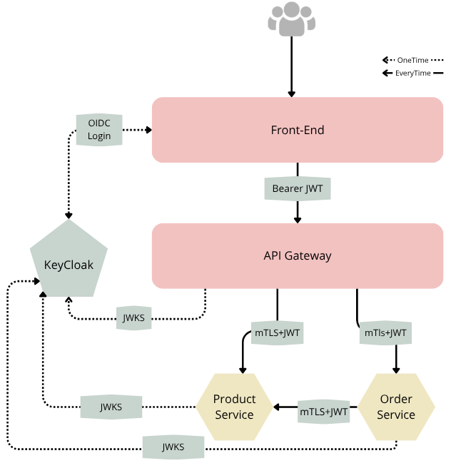

## Diagramme de séquence

Le processus commence par une authentification OIDC (OpenID Connect) entre le frontend React et Keycloak, permettant à l'utilisateur d'obtenir un jeton Bearer JWT. Ce jeton devient l'unique preuve d'identité pour toutes les requêtes suivantes.

L'API Gateway agit comme le premier rempart de sécurité : il intercepte le jeton et effectue une validation locale en récupérant les clés publiques du serveur via le protocole JWKS. Une fois la validité confirmée, la requête est transmise aux micro-services de destination. Pour renforcer la sécurité des échanges internes, les communications entre la Gateway, le Service Commande et le Service Produit sont chiffrées via TLS ou mTLS (mutual TLS), garantissant non seulement la confidentialité mais aussi l'identité mutuelle des services.

Enfin, chaque micro-service maintient une autonomie de sécurité en validant à son tour le JWT via JWKS, assurant une propagation sécurisée de l'identité de l'utilisateur tout au long de la chaîne de traitement.


## Configuration
### KeyCloak
#### Realm
microservices-realm

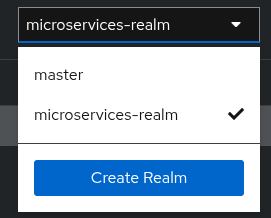

#### Roles
- MS_CLIENT
- MS_ADMIN

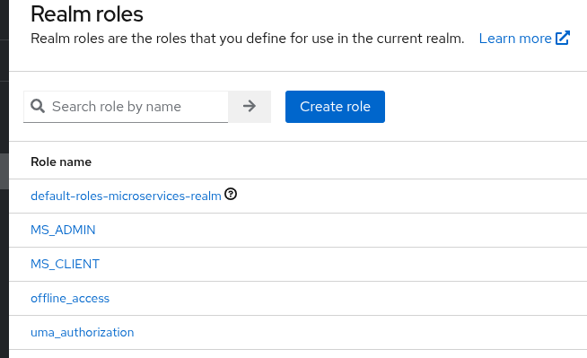
#### Client
- Client ID: react-client
- Type: OpenID Connect
- Client Authentication: OFF
- Standard Flow: ON
- Valid Redirect URIs: http://localhost:3000/*
- Web Origins: http://localhost:3000
- Root URL: http://localhost:3000
- Home URL: http://localhost:3000

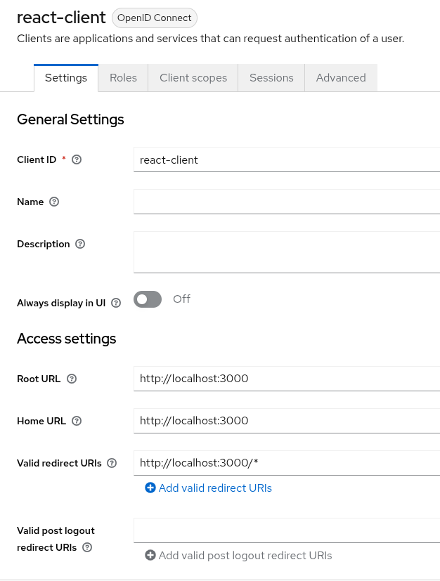
#### Users
- Username: admin1
- Password: admin
- Roles: MS_ADMIN

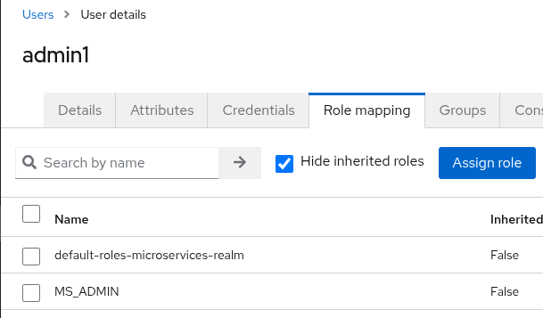
- Username: client1
- Password: client
- Roles: MS_CLIENT

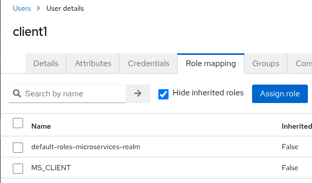

### mTLS et TLS
Conformément aux exigences avancées du projet, nous avons mis en œuvre une architecture **Zero Trust**. Au lieu de se fier uniquement à la sécurité périmétrique, chaque micro-service valide l'identité de l'appelant via des certificats numériques.

#### 1. Configuration des Micro-services (Serveur TLS)

Chaque service est configuré pour n'accepter que des connexions sécurisées via HTTPS. Le **Product Service** va plus loin en exigeant une authentification mutuelle (**mTLS**).

* **Product Service** : Utilise un `key-store` pour son identité et un `trust-store` pour vérifier les clients. La propriété `client-auth: need` impose que tout appelant présente un certificat valide.

```yaml
server:
  ssl:
    key-store: classpath:certs/product-service.p12
    trust-store: classpath:certs/truststore.p12
    client-auth: need # mTLS activé : authentification du client obligatoire

```

* **Order Service** : Sécurisé en HTTPS simple pour son exposition, mais configuré avec un certificat client pour appeler le service Produit.

```yaml
server:
  ssl:
    key-store: classpath:certs/order-service.p12

```

#### 2. Communication Inter-services Sécurisée (Client mTLS)

Lorsqu'un service doit en appeler un autre, il doit agir en tant que client authentifié.

* **Configuration du Client HTTP** : Dans `ProductServiceClientConfig.java`, nous construisons un `SSLContext` personnalisé qui injecte le certificat client (`client.p12`).

```java
SSLContext sslContext = buildSslContext(keyStore, keyStorePassword, ..., trustStore, ...);
HttpClient httpClient = HttpClient.newBuilder().sslContext(sslContext).build();

```

* **Double Protection (mTLS + JWT)** : La sécurité est cumulative. La connexion est établie via mTLS (couche transport), puis l'identité de l'utilisateur est transmise via un jeton **Bearer JWT** dans les headers (couche application).


```java
HttpRequest request = HttpRequest.newBuilder()
    .uri(URI.create(baseUrl + "/products"))
    .header("Authorization", "Bearer " + bearerToken) // Propagation du token JWT
    .GET().build();

```

#### 3. API Gateway et Routage Sécurisé

L'API Gateway centralise les flux et assure la transition vers le réseau interne sécurisé.

* **Routage HTTPS** : Les routes vers les services internes utilisent exclusivement le protocole `https://`.
* **Gateway Client** : Pour que la Gateway puisse parler au service Produit (qui exige le mTLS), elle utilise un `SslContext` client spécifique configuré avec ses propres certificats et les certificats de confiance (TrustManager).

### Dockerization

Le déploiement est orchestré pour garantir une isolation réseau et une haute disponibilité des composants de sécurité.

#### 1. La Porte d'Entrée : API Gateway

L'API Gateway sert de point d'entrée unique. Elle gère le routage intelligent vers les micro-services tout en validant les jetons JWT.

```yaml
gateway:
  build:
    context: ./gateway
  environment:
    # URL de l'émetteur de jetons pour la validation centralisée
    SPRING_SECURITY_OAUTH2_RESOURCESERVER_JWT_ISSUER_URI: http://keycloak:8080/realms/microservices-realm
    # Routage dynamique vers les services via HTTPS
    SPRING_CLOUD_GATEWAY_SERVER_WEBFLUX_ROUTES_0_URI: https://product-service:8081
    # Injection des secrets pour mTLS (via variables d'environnement)
    GATEWAY_MTLS_KEYSTORE_PASSWORD: ${GATEWAY_MTLS_KEYSTORE_PASSWORD}
  ports:
    - "8085:8085"

```

#### 2. Le Cœur Métier : Micro-services Spring Boot

Le **Product Service** et le **Order Service** sont des services indépendants. Ils intègrent une sécurité renforcée par mTLS et JWT.

```yaml
product-service:
  container_name: product-service
  environment:
    # Chaque service valide son propre jeton JWT
    SPRING_SECURITY_OAUTH2_RESOURCESERVER_JWT_ISSUER_URI: http://keycloak:8080/realms/microservices-realm
    PRODUCT_SERVICE_KEYSTORE_PASSWORD: ${PRODUCT_SERVICE_KEYSTORE_PASSWORD}
  networks:
    - keycloak-network

```

* **Communication Inter-services** : Le service commande utilise une URL sécurisée pour vérifier la disponibilité des produits.


```yaml
order-service:
  environment:
    PRODUCT_SERVICE_BASE_URL: https://product-service:8081
```

#### 3. L'Interface Utilisateur : React App

Le frontend communique exclusivement avec l'API Gateway. L'URL de Keycloak est injectée au build pour permettre la connexion OIDC.

```yaml
react-app:
  build:
    context: ./react-app
    args:
      # URL utilisée par la bibliothèque Keycloak-JS au runtime
      REACT_APP_KEYCLOAK_URL: http://keycloak:8080
  ports:
    - "3000:80"

```

#### 4. La Gestion d'Identité (IAM) : Keycloak & Postgres

Keycloak gère l'authentification et l'autorisation basée sur les rôles (ADMIN, CLIENT). Il s'appuie sur une base PostgreSQL dédiée.

```yaml
keycloak:
  image: quay.io/keycloak/keycloak:21.1.1
  environment:
    KC_DB_URL: jdbc:postgresql://postgres:5432/keycloak
    KC_HOSTNAME_STRICT: false
  command: start-dev # Mode développement pour faciliter la configuration
  depends_on:
    postgres:
      condition: service_healthy # Attente de la disponibilité de la BDD

postgres:
  image: postgres:15
  healthcheck:
    # Commande de vérification de santé pour garantir la robustesse
    test: ["CMD-SHELL", "pg_isready -U keycloak"]

```

## DevSecOps
### [Pipeline CI](https://github.com/Zakaria-Farahi/DevSecOpsDevoir/actions/runs/20894866293/job/60031762139)

Cette pipeline permet de vérifier automatiquement que le code fonctionne à chaque fois qu'un membre de l'équipe fait un **Push** ou une **Pull Request**. Elle garantit qu'aucune erreur ne casse l'application.

#### 1. Préparation de l'environnement

La pipeline commence par récupérer le code et installer les versions nécessaires de Java et Node.js.

```yaml
- name: Set up Java
  uses: actions/setup-java@v4
  with:
    java-version: "21" # Utilisation de Java 21 pour le Backend
```

#### 2. Build des Micro-services (Backend)

Elle compile et teste chaque service Spring Boot. Si un test échoue, la pipeline s'arrête.

```yaml
- name: Build product-service
  run: mvn -q verify
  working-directory: product-service
```

* **Services vérifiés** : Gateway , Product Service et Order Service.

#### 3. Build & Test du Frontend (React)

Elle installe les dépendances, lance les tests unitaires et vérifie que l'application React peut être construite sans erreur.

```yaml
- name: Frontend tests
  run: npm test -- --watchAll=false
  working-directory: react-app
```

### [Ajouter GitLeaks](https://github.com/Zakaria-Farahi/DevSecOpsDevoir/actions/runs/20895070840)
Dans une démarche **DevSecOps**, il est critique de ne jamais exposer de mots de passe ou de clés API dans le code source. Nous avons intégré **Gitleaks** pour auditer automatiquement chaque commit.

#### Comment ça marche ?

Gitleaks scanne l'historique de votre projet à la recherche de signatures spécifiques (Regex) correspondant à des secrets connus comme des clés AWS, des mots de passe de base de données ou des clés API dans les fichiers `.env`. Si un secret est détecté, la pipeline échoue immédiatement pour empêcher la fuite.

```yaml
secret-scan:
  runs-on: ubuntu-latest
  steps:
    - name: Run gitleaks
      uses: gitleaks/gitleaks-action@v2
      with:
        args: --source . --redact # Scanne le code et masque les secrets dans les logs
```

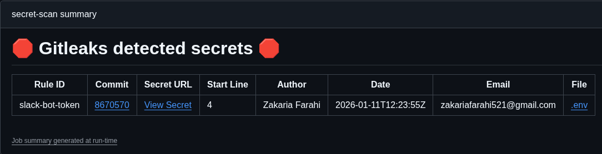

### [Ajouter SAST avec SonarCloud](https://github.com/Zakaria-Farahi/DevSecOpsDevoir/runs/60037018014)

Nous utilisons **SonarCloud** pour effectuer une analyse statique de la sécurité (SAST). Cet outil analyse le code source sans l'exécuter pour trouver des failles de sécurité, des bugs ou des mauvaises pratiques.

#### Comment ça marche ?

Une fois que le projet est construit et testé, SonarCloud scanne l'intégralité du code (Java et React). Il génère un rapport détaillé sur la qualité du code et la présence de vulnérabilités potentielles.

```yaml
- name: SonarCloud scan
  uses: SonarSource/sonarcloud-github-action@v2
  env:
    SONAR_TOKEN: ${{ secrets.SONAR_TOKEN }}
    GITHUB_TOKEN: ${{ secrets.GITHUB_TOKEN }}
```
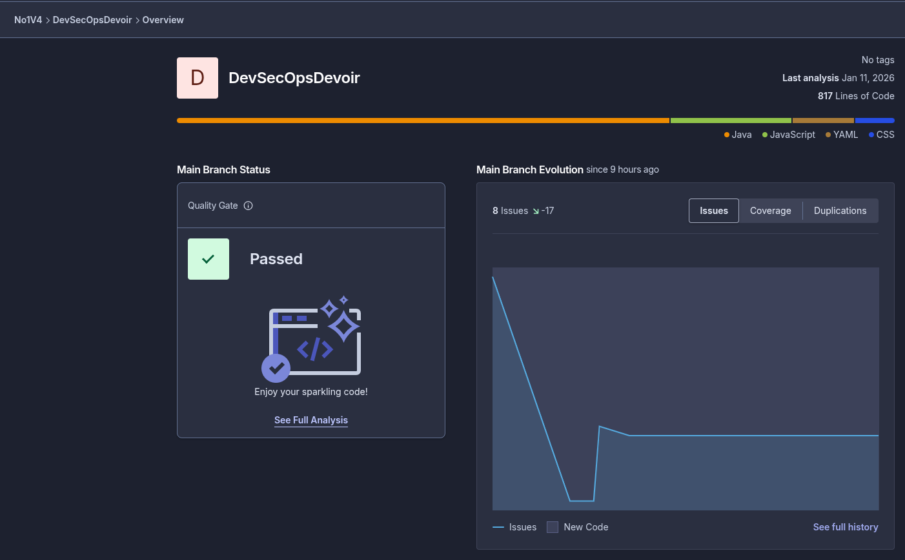

### Ajouter SCA avec OWASP Dependency-Check
La sécurité ne concerne pas seulement notre code, mais aussi les bibliothèques tierces que nous utilisons. Nous utilisons **OWASP Dependency-Check** pour identifier les vulnérabilités connues (CVE) dans nos dépendances.

#### Comment ça marche ?

L'outil scanne les fichiers de dépendances (`pom.xml` pour Java et `package-lock.json` pour React) et les compare à la base de données nationale des vulnérabilités (NVD).

```yaml
- name: OWASP Dependency-Check
  uses: dependency-check/Dependency-Check_Action@main
  with:
    path: .
    args: >-
      --failOnCVSS 7  # Arrête la pipeline si une faille grave (score > 7) est trouvée
      --scan gateway
      --scan product-service
      --scan order-service
      --scan react-app
```
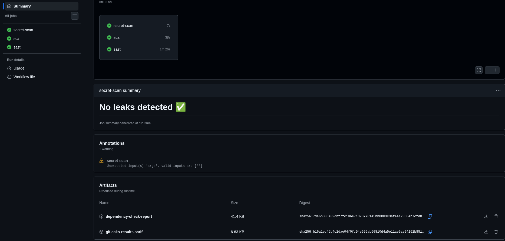

#### Points clés de la configuration :

* **Détection Automatique** : Scanne simultanément les micro-services Java et l'application React.
* **Blocage de Sécurité** : La pipeline échoue automatiquement si une vulnérabilité avec un score de sévérité supérieur ou égal à **7** est détectée.
* **npm audit** : En complément, nous utilisons `npm audit` pour vérifier spécifiquement les bibliothèques JavaScript en production.
* **Rapports de Traçabilité** : Un rapport HTML détaillé est généré et sauvegardé comme artefact après chaque exécution.

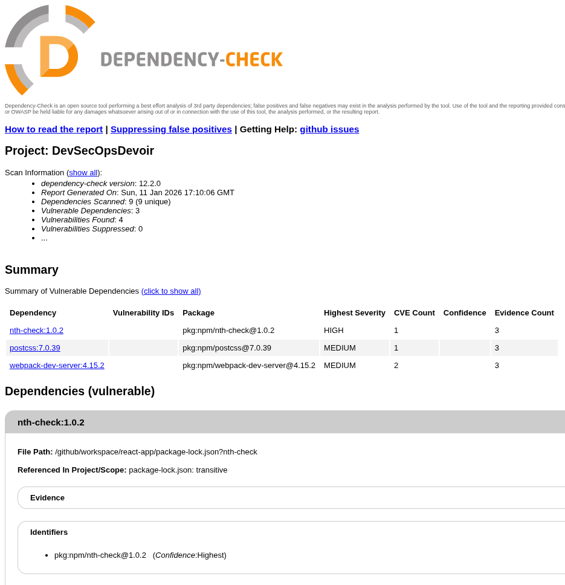

### Ajouter Triviy pour 
Dans une architecture micro-services, la sécurité de l'image de conteneur est aussi importante que celle du code. Nous utilisons **Trivy** pour scanner nos images Docker afin de détecter des vulnérabilités au niveau du système d'exploitation et des packages installés.

#### Comment ça marche ?

Pour chaque service, la pipeline construit d'abord l'image Docker, puis Trivy analyse cette image à la recherche de failles de sécurité connues.

```yaml
- name: Trivy scan - product-service
  uses: aquasecurity/trivy-action@0.33.1
  with:
    image-ref: devsecops/product-service:ci
    format: "table"
    exit-code: "1" # Arrête la pipeline si des failles sont trouvées
    severity: "HIGH,CRITICAL" # Se concentre sur les menaces graves
```

#### Points clés de la sécurité des conteneurs :

* **Build et Scan** : Toutes les images (Gateway, Product, Order, et React) sont vérifiées avant d'être considérées comme sûres.
* **Blocage Automatique** : La pipeline s'arrête immédiatement (`exit-code: 1`) si une vulnérabilité de niveau **HIGH** (Haute) ou **CRITICAL** (Critique) est détectée.
* **Rapport Clair** : Les résultats sont affichés sous forme de tableau directement dans les logs de GitHub Actions pour une identification rapide des packages à mettre à jour.

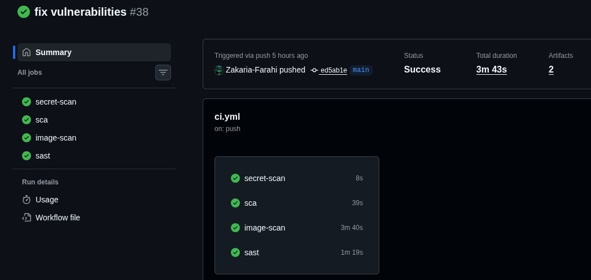

## Guide de démarrage
```bash
git clone https://github.com/Zakaria-Farahi/DevSecOpsDevoir
# Configuration des variables d'environnement (le fichier .env pour les mots de passe des keystores).
docker compose up --build
```
acces via http://localhost:3000/